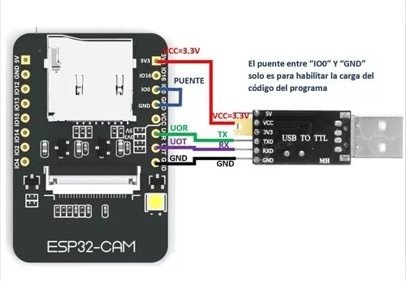
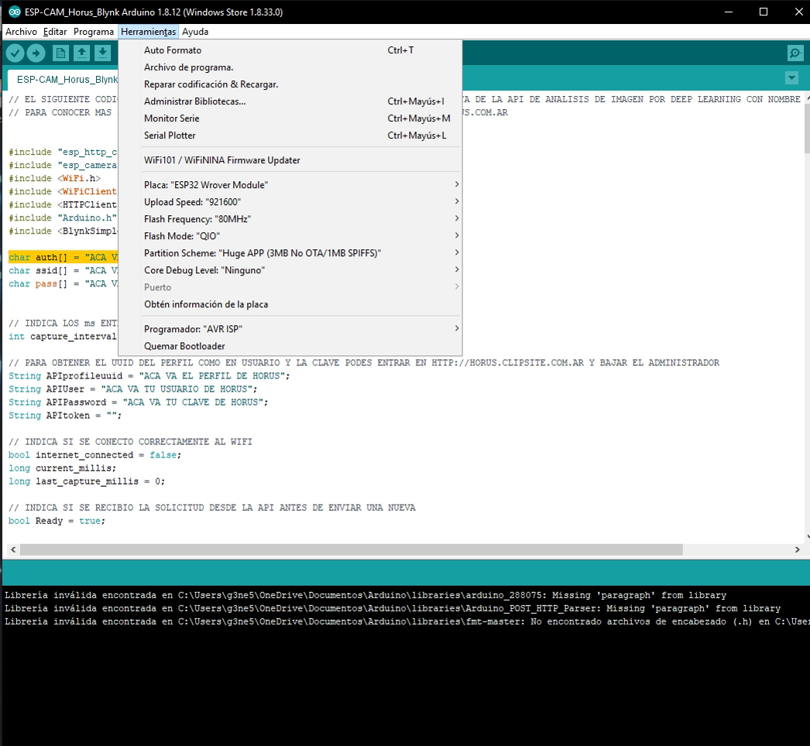

# PROYECTO HORUS: CloudSign

CloudSign es el sistema de control biométrico para fichado de personal, apertura de puertas o control termino de SeaMan SRL. 

Pensado para ser de bajo costo y alta prestación, CloudSign está basada en tecnología Open hardware como la Arduino Nano y la ESP32-cam.

Funciona gracias a las API en Cloud de https://www.ProyectoHorus.com.ar pero puede ser usado también en modo Stand Alone.

 En el siguiente repositorio podrá encontrar todas las fuentes tanto para la Arduino como para la ESP32-cam como asi también los PCB en donde ambas placas se conectan, el manual de usuario, el esquema de chasis y los fuentes del administrador en red de nuestra cerradura biométrica.

También es posible descargar los programas compilados desde https://www.proyectohorus.com.ar/CloudSign como también adquirir el producto en caja cerrada.

# Elementos requeridos

- 1x ESP32-CAM Wrover Module
- 1x Arduino Nano v1/v2
- 1x Tira LED Neopixel x8 leds
- 1x Rele
- 1x Pirometro Optris (Opcional)
- 1x Pantalla LCD DotMatrix 2 lineas con adaptador I2C
- 1x Beeper
- 1x Memoria microSD (Formateada para FAT32)
- 1x Transformador 7,5V / 2A
- 1x Pigtail antena ESP32
- 1x Antena 5dBi
- 1x Conector RJ45 para chasis
- 1x Sensor Ultrasonico Hc-sr04 (Opcional)
- Cables
- 2x 

# Cargar el codigo en la ESP32-CAM

Para copiar el codigo a la ESP32-Cam se requiere de un adaptador USB-TTL el cual ira conectado de la siguiente manera:

La configuración del entorno arduino para la carga sera:

Nota: Si hay problemas para subir el codigo a la placa y todo parace corresponder correctamente debera probar invirtiendo el RX y el TX de la placa TTL.

# Dentro de las funciones de la API para CloudSign podemos encontrar

El Proyecto Horus consiste en una API REST que permite de forma simple identificar imágenes vía redes neuronales.

- FACE ID
- FACE MASK

Administra la API directo desde tu back usando la documentación en Swagger https://www.proyectohorus.com.ar/Documentacion/Administrador.json

# Seguime en:
https://www.linkedin.com/in/fernando-p-maniglia/

# Conocenos más en:
https://www.seamansrl.com.ar
