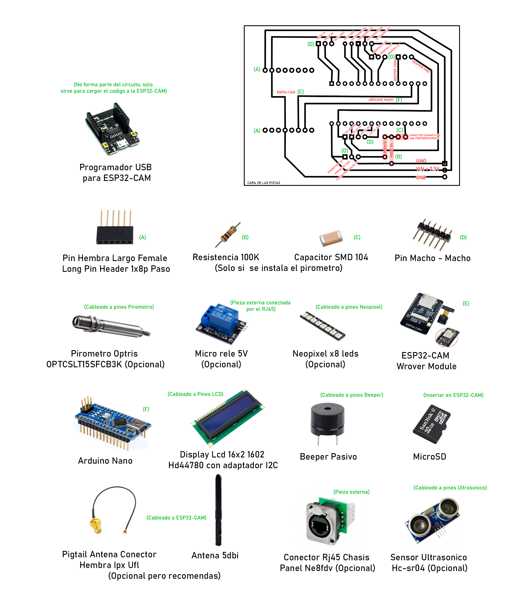

# PROYECTO HORUS: CloudSign

CloudSign es el sistema de control biométrico para fichado de personal, apertura de puertas o control termino de SeaMan SRL. 

Pensado para ser de bajo costo y alta prestación, CloudSign está basada en tecnología Open hardware como la Arduino Nano y la ESP32-cam.

Funciona gracias a las API en Cloud de https://www.ProyectoHorus.com.ar pero puede ser usado también en modo Stand Alone.

 En el siguiente repositorio podrá encontrar todas las fuentes tanto para la Arduino como para la ESP32-cam como asi también los PCB en donde ambas placas se conectan, el manual de usuario, el esquema de chasis y los fuentes del administrador en red de nuestra cerradura biométrica.

También es posible descargar los programas compilados desde https://www.proyectohorus.com.ar/CloudSign como o adquirir el producto en caja cerrada.

# Elementos requeridos

- 1x ESP32-CAM Wrover Module
- 1x Arduino Nano v1/v2
- 1x Tira LED Neopixel x8 leds
- 1x Micro Rele
- 1x Pirometro Optris (Opcional)
- 1x Display Lcd 16x2 Backlight Azul 1602 Hd44780 Arduino Pic con adaptador I2C
- 1x Beeper pasivo
- 1x Memoria microSD (Formateada para FAT32)
- 1x Transformador 7,5V / 2A
- 1x Cable Pigtail Antena Conector Hembra Ipx Ufl Ard Pic para ESP32-cam
- 1x Antena 5dBi
- 1x Conector Rj45 Chasis Panel Ne8fdv Ethercon Vertical
- 1x Sensor Ultrasonico Hc-sr04 (Opcional)
- Cables
- 2x Pin Hembra Largo Female Long Pin Header 1x8p Paso (Aca se conecta la ESP32-CAM)
- 1x Resistencia 100K
- 1x Capacitor ceramico 104

# Primeros pasos

Antes de empezar debemos verificar tener todos los componente, incluida nuestra PCB y el programador para la ESP32-Cam (ver Cargar el codigo en la ESP32-CAM).
Instalaremos cada componente en la PCB según se muestra en las siguientes imágenes:  

Nota: Los pines de conexión a los elementos externos (LCD, Neo Pixel, Beeper, Etc) van del lados de las pistas. Si bien es más complicado soldar pines de esta forma, hacerlo así nos ahorra tener que hacer una PCB de dos capas ahorrando tiempo y dinero.

Otro detalle importante es notar que la ESP32-Cam está superpuesta a la Arduino, por tanto deberemos quitarle a esta última los 6 pines que sobresalen en la punta contraria al Conector USB del lado del Microcontrolador. A su vez debemos soldar los (Pin Hembra Largo Female Long Pin Header 1x8p Paso) a la PCB y poner la ESP32-Cam en ellos para darle altura.

Último detalle: si pensamos usar un gabinete metálico, deberemos usar una antena externa, pero ojo por que las ESP32-Cam tienen una resistencia que sirve para seleccionar entre el conector a pigtail y la antena integrada. Es una resistencia SMD muy muy pequeña que deberemos cambiar de posición, ver este vídeo para más información (https://m.youtube.com/watch?v=ckPu18lrBkE)

# Perisfericos.

Vamos a ver 7 conjuntos de pines para conexiones exteriores:

- RS232 (3 pines Negativo TX y RX)
- Tira Neopixel (3 pines Negativo, Positivo y Data)
- LCD (4 Pines Negativo, Positivo, Data y Clock)
- Beeper (2 pines Negativo y señal)
- Rele (3 Pines Negativo, Positivo y Trigger)
- Pitometro (3 Pines Negativo, Positivo y Señal analógica)
- Ultrasónico (4 Pines Negativo, Positivo, Trigger y Retorno)

# Comunicación entre placas.

Si bien es verdad que podría hacerse todos con solo la ESP32-Cam, vemos que ésta está un tanto limitada en pines de salida como así también tiene un serio problema con su pin Analógico-Digital el cual tiende a ser bastante inseparable, es por esto que acudimos a una Arduino Nano como soporte para el control de todos los elementos externos dejando a la ESP32-Cam con las funciones de red y calculo. Podríamos decir que la Arduino hace de placa IDE mientras que la ESP32-Cam ee el Mother, memoria y el CPU.
Para que ambas placas compartan información, usamos los pines RS323 mandando mensajes cortos separados por pipe (|) en donde tenernos el comando seguido de los parámetros. La comunicación si bien es bi-direccional en el sentido de que ambas placas se comparten datos, el proceso es tipo BroadCast ya que no se espera confirmación de recepción. 
Es importante no cambiar la velocidad de comunicación entre las placas, ya que la codificada es la velocidad nativa, velocidades menores o mayores devendrán en errores.

# Servicio Cliente-Servidor

CloudSign trabaja en un esquema denominado FOG en donde parte de los procesos se realizan de forma local y parte de ellos en nube. 

De forma local se realiza un disparo inicial usando Face Detection, Motion Detection o Temperature Detection, cuando alguno de estos gatillos se activa, la ESP32-CAM obtiene una imagen de la persona que esta frente a la cámara y la envía al servidor de Proyecto Horus, quien será el encargado de analizar la imagen en búsqueda de la coincidencia buscada: Uso de tapabocas, Identificación de rostro, Uso de elementos de seguridad, etc. Si la respuesta es positiva Horus podrá informar sobre el rango horario habilitado para la persona o si esta se encuentra bloqueada por algún motivo como asi también puede devolver una URL a donde se deberá consultar sobre el perfil de acceso del usuario en caso de que se quiera usar un sistema de autenticación externo.

# Gestion de usuarios

Para una rápida y simple implementación y posterior gestión de los usuarios habilitados, sus horarios, como asi también la configuración de la ESP32-CAM y el análisis en tiempo real de lo que esta ocurriendo en el dispositivo biométrico, es que se implemento un gestor de usuarios el cual tiene sus fuentes en la carpeta “Manager” o se puede bajar ya compilado desde (https://www.proyectohorus.com.ar/cloudsign/descargas/windows/setup.zip). 

# Códigos avanzados de configuración:

Además de las variables generadas automáticamente por el  administrador, tal como se vio en las páginas: 22 a 26 del manual de usuario (Manual.pdf), CloudSign cuenta con parámetros avanzados que le permitirán ajustar a los aspectos internos para asi adaptar al dispositivo a la mayor cantidad de escenarios posibles.
Antes de empezar a enumerar cada parámetro y el tipo de valor este toma, hay que destacar que estos van en el mismo archivo .json de la configuración como elementos adicionales y siempre se deberán escribir en minúsculas (Estos valores se encuentras en el directorio raiz de la microSD bajo el nombre de "config.json"):

- ssid: (Tipo String) Define el nombre de la red WiFi donde se debe conectar CloudSign para poder traficar datos hacia el servidor Horus.

Ejemplo:
{
“ssid”: “MI_WiFi”
}
Password: (Tipo String) Define la clave de la red Wifi.
Ejemplo:
{
“ssid”: “MI_WiFi”,
“Password”: “MI_Clave”
}

- api_profile_uuid: (Tipo String) Define el UUID que identifica el 
perfil de detección dentro de la plataforma on-line (Ver pagina 22).
api_user: (Tipo String) Define el nombre de usuario requerido para 
conectar a la plataforma on-line (Ver pagina 22).
api_password: (Tipo String) Define el la clave requerida para conectar 
a la plataforma on-line (Ver pagina 22).
33

- tem_not_required: (Tipo boleano) Le indica al dispositivo que no se 
debe tener en cuenta la temperatura medida para dar acceso (Ver pagina 
23).

- id_not_required: (Tipo boleano) Le indica al dispositivo que no se 
debe tener en cuenta el reconocimiento de rostro ni ningún tipo de 
análisis de imagen bajo lógica Cloud para dar acceso (Ver pagina 23).

- face_not_required: (Tipo boleano) Le indica al dispositivo que no 
verifique la existencia de un rostro para iniciar el proceso de 
captura de temperatura e imagen pudiendo usarse como disparadores 
cambios térmicos o detección de movimiento (Ver pagina 23).

- min_temp: (Tipo flotante) Indica la cota inferior de la escala de 
temperaturas a tener en cuenta para considerar al objeto medido como 
una persona, Ejemplo: 33.5

- max_temp: (Tipo flotante) Indica la cota superior de la escala de 
temperaturas a tener en cuenta para considerar al objeto medido como 
una persona, Ejemplo: 42.5

- alert_temp: (Tipo flotante) Indica la temperatura máxima permitida 
para habilitar el acceso, ejemplo: 37.9

- offset: (Tipo flotante) Suma un valor fijo en grados para ajustar la 
calibración del pirómetro. Esta función es particularmente útil en 
lugares muy fríos donde se deberá ajustar un par de grados para 
compensar la temperatura ambiente. 

Ejemplo, en situación de temperatura ambiente natural el pirómetro 
registrara a una persona saludable en el rango de lo 35.5 grados y los 
36.9 grados centígrados, no obstante, si esta misma persona se ubica 
en un ambiente frio las mediciones podrían bajar a 33.1 y 34.5 grados 
por lo cual el offset nos ayuda a compensar esa diferencia.

- scale: (Tipo flotante) Permite setear un valor de escala que modifique 
el valor real entregado por el pirómetro.

- temp_trigger: (Tipo flotante) CloudSign es capaz de detectar si hay 
una persona frente al dispositivo utilizando varios medios tanto en 
Edge (local), como en Cloud (remoto). Dentro de las estrategias de 
detección local se encuentras a la detección de rostro, la detección 
de movimiento y el cambio brusco de temperatura. “temp_trigger” viene 
justamente a indicar que valor entre 0 y 1 debe variar la temperatura 
para considerar que hay un cuerpo frente al dispositivo, donde el 
34
valor 0 representa a 0% y 1 al 100% con todos los valores flotantes 
intermedios. Por defecto el dispositivo esta ajustado en 5% o sea 
0.05.

- action_wait: (Tipo integral) Indica cuanto tiempo en milisegundos debe 
estar accionado un rele tras una detección. Ejemplo, si tras ser 
autorizado, una persona tarda 4 segundos en atravesar la puerta o 
molinete desbloqueado por el rele, el valor de espera antes de que se 
vuelva a bloquear el mecanismo debería ser del al menos 6 segundos o 
sea 6000.

- min_box_size: (Tipo integral) Indica el tamaño mínimo que debe tener 
el objeto o rostro detectado para ser tomado en cuenta. 
Imaginemos este caso, dos personas a la vez se posicionan frente al 
dispositivo, una bien de frente y otra de fondo, ¿a cuál se le da 
prioridad?, pues a la mas cernada, claro, pero como definimos que es 
cerca y que es lejos, pues usando “min_box_size” que indica el alto o 
ancho mínimo en pixeles que debe tener el objeto detectado para ser 
considerado valido.

- edge_detector_min_face: (Tipo integral) Valor interno del algoritmo de 
detección de rostros MCTNN.

- edge_detector_pyramid: (Tipo flotante) Valor interno del algoritmo de 
detección de rostros MCTNN. 

- edge_detector_pyramid_times: (Tipo integral) Valor interno del 
algoritmo de detección de rostros MCTNN. 

- pnet_score: (Tipo flotante) Valor interno del algoritmo de detección 
de rostros MCTNN. 

- pnet_mns: (Tipo flotante) Valor interno del algoritmo de detección de 
rostros MCTNN. 

- pnet_candidate_number: (Tipo integral) Valor interno del algoritmo de 
detección de rostros MCTNN. 

- rnet_score: (Tipo flotante) Valor interno del algoritmo de detección 
de rostros MCTNN. 

- rnet_mns: (Tipo flotante) Valor interno del algoritmo de detección de 
rostros MCTNN. 

- rnet_candidate_number: (Tipo integral) Valor interno del algoritmo de 
detección de rostros MCTNN. 

- onet_score: (Tipo flotante) Valor interno del algoritmo de detección 
de rostros MCTNN. 
35
- onet_score: (Tipo flotante) Valor interno del algoritmo de detección 
de rostros MCTNN. 

- onet_mns: (Tipo flotante) Valor interno del algoritmo de detección de 
rostros MCTNN. 

- onet_candidate_number: (Tipo integral) Valor interno del algoritmo de 
detección de rostros MCTNN. 

- ok_url: (Tipo String) dirección URL iniciada con http:// o https:// 
que indica donde se deberán postear los datos tras obtener una 
detección habilitada. 

- ok_verb: (Tipo String) Indica si se debe enviar con el verbo POST o 
GET

- fail_tmp_url: (Tipo String) dirección URL iniciada con http:// o 
https:// que indica donde se deberán postear los datos tras bloquear 
un acceso por temperatura alta.

- fail_temp_verb: (Tipo String) Indica si se debe enviar con el verbo 
POST o GET

- fail_Unknow_url: (Tipo String) dirección URL iniciada con http:// o 
https:// que indica donde se deberán postear los datos tras bloquear 
un acceso por usuario desconocido o no registrado.
fail_unknow_verb: (Tipo String) Indica si se debe enviar con el verbo 
POST o GET

- ttl_url: (Tipo String) CloudSign es capaz de habilitar accesos usando 
tarjetas RFID, NFC, Teclado, Lector de huellas entre otros, pero estos 
valores deberán ser convertidos al UUID de identificación interna del 
dispositivo para poder ser usados como valores de acceso válidos. 

- TTL_URL indica a que servidor se debe llamar para realizar esa 
conversión. (Ver manual de programación avanzada)
 
- ttl_verb: (Tipo String) Indica si se debe enviar con el verbo POST o 
GET (Ver manual de programación avanzada)

- ttl_timeout: (Tipo integral) Indica cuanto tiempo es milisegundos se 
debe esperar para verificar un rostro o tomar una temperatura tras 
registrar la lectura de una tarjeta RFID, NFC, etc
36

- horus_mode: (Tipo integral) cuando se indica el valor “0” se le estará 
informando al dispositivo que la autenticación se dera vía el 
algoritmo de FaceID, mientras que si indica el valor como “1” se le 
estará informando al dispositivo que la autenticación se dará vía 
reconocimiento de imágenes, ejemplo: Tapaboca, Elementos de seguridad, 
etc.

-horus_auth: (Tipo integral) cuando se indica el valor “0” CloudSign
habilitara el acceso a cualquier usuario registrado sin amparar días u 
horas habilitadas. Si se indica el valor “1”, CloudSign utilizara la 
metadata de acceso avanzado para autorizar el acceso. (Ver manual de 
programación avanzada)

- device_name: (Tipo String) Indica un nombre para identificar al 
dispositivo en una red local.

- clock_offset: (Tipo integral) Indica la cantidad de segundos que se le 
debara sumar o restar a la hora del meridiano 0 para ajustar la hora a 
la hora local. Ejemplo: para Bs As es -3hs o sea que deberemos poner 10800.

- block_diff: (Tipo flotante) forma parte del algoritmo de detección de 
movimiento.

- image_diff: (Tipo flotante) forma parte del algoritmo de detección de 
movimiento.

- custom_vars: (Tipo String) Permite especificar una variable 
personalizada para poder detectar un dispositivo al enviar un mensaje 
REST a un servidor externo (Ver manual de programación avanzada).

- voltage_ref: (Tipo flotante) Permite seleccionar un valor entre 0.0 y 
5.0 volt que se usara como referencia por el conversor analógico
digital para la lectura del pirómetro. El valor por defecto es 4.9

- ftp_user: (Tipo String) Permite seleccionar un usuario personalizado 
para el acceso al FTP de configuración local del dispositivo. (Ver 
pagina 22)

- ftp_password: (Tipo String) Permite seleccionar una clave 
personalizada para el acceso al FTP de configuración local del 
dispositivo. (Ver pagina 22)

- PersonalCam: (Tipo boleano) Habilita el ajuste manual y fijo de los 
parámetros de la camara.
37

- brightness: (Tipo Integral)(Solo aplica con PersonalCam = true) Valor 
entre -2 y 2 que indica cuanto se debe modificar el brillo de la 
camara.

- contrast: (Tipo Integral)(Solo aplica con PersonalCam = true) Valor 
entre -2 y 2 que indica cuanto se debe modificar el contraste de la 
camara.

- saturation: (Tipo Integral)(Solo aplica con PersonalCam = true) Valor 
entre -2 y 2 que indica cuanto se debe modificar la saturación de 
color de la camara.

- special_effect: (Tipo Integral)(Solo aplica con PersonalCam = true)
indica un valor de 0 a 6 para ajustar color y efectos de corrección en 
la camara:

0: No Effect
1: Negative
2: Grayscale
3: Red Tint
4: Green Tint
5: Blue Tint
6: Sepia

- whitebal: (Tipo Integral)(Solo aplica con PersonalCam = true) Setea la 
forma en la que se realizaran los balances de blanco.

0: Manual
1: automático

- awb_gain: (Tipo Integral)(Solo aplica con PersonalCam = true) Setea si 
la ganancia en blancos se realiza de forma automática o manual.

0: Manual
1: automático
- wb_mode: (Tipo Integral)(Solo aplica con PersonalCam = true)(Solo 
aplica con awb_gain = 1) Setea el modo de balance de blandos.

0: Auto
1: Sunny
2: Cloudy
3: Office
4: Home

- exposure_ctrl: (Tipo Integral)(Solo aplica con PersonalCam = true) 
Setea el modo de exposición de la camara

0: Manual
1: Automatico
38

- aec2: (Tipo Integral)(Solo aplica con PersonalCam = true) Setea el 
modo de exposición avanzado de la camara

0: Manual
1: Automatico

- ae_level: (Tipo Integral)(Solo aplica con PersonalCam = true) Valor 
entre -2 y 2 que indica el nivel de exposición que deberá tener la 
camara cuando se ajusta a aec2 en manual (0).
aec_value: (Tipo Integral)(Solo aplica con PersonalCam = true) Valor 
entre 0 y 1200 que indica cual es el rango de exposición máximo que 
puede tomar la camara en modo automático.

- gain_ctrl: (Tipo Integral)(Solo aplica con PersonalCam = true) Indica 
si la ganancia de la camara será realizada de forma manual “0” o 
automática “1”.

- agc_gain: (Tipo Integral)(Solo aplica con PersonalCam = true) Valor de 
0 a 30 que indica el nivel de ganancia que puede tomar la camara en 
modo manual o sea con gain_ctrl = 0.
gainceiling: (Tipo Integral)(Solo aplica con PersonalCam = true) Valor 
de 0 a 6 que indica el nivel de ganancia que puede tomar la camara en 
modo automático o sea con gain_ctrl = 1.

- bpc: (Tipo Integral)(Solo aplica con PersonalCam = true) Valor “0” o 
“1” que indica si se activa la eliminación de ruido por hardware.

- wpc: (Tipo Integral)(Solo aplica con PersonalCam = true) Valor “0” o 
“1” corrección de blanco automático.

- raw_gma: (Tipo Integral)(Solo aplica con PersonalCam = true) Valor “0” 
o “1” que activa o desactiva el manejo raw de imagen.

- lenc: (Tipo Integral)(Solo aplica con PersonalCam = true) Valor “0” o 
“1” que activa o desactiva la corrección de lente de pez.

- hmirror: (Tipo Integral)(Solo aplica con PersonalCam = true) Valor “0” 
o “1” que voltea la imagen en lo horizontal.

- vflip: (Tipo Integral)(Solo aplica con PersonalCam = true) Valor “0” o 
“1” que voltea la imagen en lo vertical.

# Cargar el codigo en la ESP32-CAM

Para copiar el codigo a la ESP32-Cam se requiere de un adaptador USB-TTL el cual ira conectado de la siguiente manera:

La configuración del entorno arduino para la carga sera:

Nota: Si hay problemas para subir el codigo a la placa y todo parace corresponder correctamente debera probar invirtiendo el RX y el TX de la placa TTL.

# Dentro de las funciones de la API para CloudSign podemos encontrar

El Proyecto Horus consiste en una API REST que permite de forma simple identificar imágenes vía redes neuronales.

- FACE ID
- FACE MASK

Administra la API directo desde tu back usando la documentación en Swagger https://www.proyectohorus.com.ar/Documentacion/Administrador.json

# Seguime en:
https://www.linkedin.com/in/fernando-p-maniglia/

# Conocenos más en:
https://www.seamansrl.com.ar
